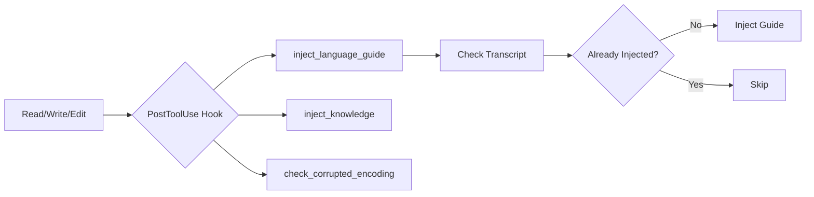

# Opinionated Basic Claude Code Setup

An opinionated, production-ready Claude Code plugin that automatically injects critical context to help Claude understand your codebase better and maintain consistent coding standards.

## Why This Plugin Exists

When working with Claude Code, you often find yourself repeatedly explaining:
- Your coding conventions and style preferences
- Project-specific patterns and architecture decisions
- Language-specific best practices you follow
- File encoding issues that corrupt your code

This plugin solves these problems by **automatically injecting the right context at the right time**, so Claude always knows:
- How you write code in each language
- What your project conventions are
- When files have encoding issues

## Core Philosophy

### Opinionated by Design
This isn't a generic plugin. It contains **specific, production-tested coding conventions** that have been refined through real-world usage. The included guides represent battle-tested best practices for:

- **Type-safe Python development** with async-first patterns
- **Modern Svelte 5** with proper rune usage
- **Project knowledge management** for team consistency

If these opinions align with your workflow, you'll get immediate value. If not, you can easily customize the language guides to match your preferences.

## What Problems Does This Solve?

### Problem 1: Repetitive Context Setting

**Before this plugin:**
```
You: "Please fix this Python function"
Claude: *writes code with wrong style*
You: "No, we use type hints for everything"
Claude: "Oh, let me fix that..."
You: "Also we use async-first patterns with Django ORM"
Claude: "Got it, updating..."
You: "And we follow these specific testing conventions..."
```

**After this plugin:**
```
You: "Please fix this Python function"
Claude: *automatically has all your Python conventions*
Claude: *writes perfect code matching your style on first try*
```

### Problem 2: Lost Project Context

**Before this plugin:**
- You have a `claude.md` file documenting your project
- Claude doesn't know it exists unless you explicitly tell it
- You waste time re-explaining architecture decisions
- Different team members get inconsistent results

**After this plugin:**
- Any `claude.md` or `agents.md` files are automatically discovered
- Claude always has your project context loaded
- Consistent results across your entire team
- Zero manual context management

### Problem 3: Silent File Corruption

**Before this plugin:**
```
Claude: "I've written the file"
You: *opens file, sees garbage characters*
You: "The file is corrupted!"
Claude: "Let me try again..."
*Repeat 3-4 times*
```

**After this plugin:**
```
Claude: *writes file*
Plugin: "WARNING: Encoding issue detected!"
Claude: *immediately rewrites correctly*
```

## Features Deep Dive

### 1. Language-Specific Guide Injection

#### What It Does
Automatically injects comprehensive coding guides when you work with files in supported languages.

#### Why You Need This

**The Problem:**
- Every language has idioms, anti-patterns, and best practices
- Claude doesn't inherently know YOUR preferred patterns
- Without guidance, you get inconsistent code quality
- You waste time fixing style issues in code reviews

**The Solution:**
When you read or write a Python file, Claude automatically receives:
- Type safety requirements (all functions must have type hints)
- Async patterns (use `async for` with Django ORM, never `alist()`)
- Testing conventions (pytest structure, fixture placement rules)
- Package manager preferences (uv over poetry/conda)
- Import patterns (explicit re-exports, no `__all__`)

#### Current Language Support

**Python (`py.md`)**
- **Type Safety**: Enforces comprehensive type hints, prevents `-> Any`
- **Async-First Django**: Proper async ORM patterns, eager loading strategies
- **Testing Standards**: pytest conventions, AAA pattern, fixture organization
- **Package Management**: uv for modern projects, poetry for legacy
- **Code Style**: No abbreviations, explicit naming, no nested imports

**Why these specific rules?**
- Type hints catch bugs at development time, not production
- Async-first prevents performance bottlenecks in Django
- Pytest conventions ensure maintainable test suites
- uv is faster and more reliable than legacy tools
- Explicit naming improves code readability for teams

**Svelte (`svelte.md`)**
- **Svelte 5 Runes**: Proper `$state`, `$derived`, `$effect` usage
- **Reactivity Patterns**: Avoiding common pitfalls with proxies
- **Component Best Practices**: Props, state management, lifecycle
- **SvelteKit Integration**: Routing, load functions, form actions

**Why Svelte 5 specifically?**
- Runes are the future of Svelte (Svelte 4 syntax is legacy)
- Common mistakes (destructuring reactive proxies) cause subtle bugs
- SvelteKit patterns differ significantly from other frameworks

#### How to Add Your Own Languages

Create `modular-prompts/languages/{ext}.md`:

```markdown
<style>
    <naming>
        Use camelCase for variables
        Use PascalCase for classes
    </naming>

    <patterns>
        Always use composition over inheritance
        Prefer immutability
    </patterns>
</style>
```

### 2. Project Knowledge Injection

#### What It Does
Automatically finds and injects `claude.md` and `agents.md` files from your project.

#### Why You Need This

**The Problem:**
- Your team documents architecture decisions in `claude.md`
- New contributors don't know this file exists
- Claude doesn't automatically read it
- You repeatedly re-explain the same context
- Team consistency suffers

**The Solution:**
The plugin walks up from any file to your project root, finding:
- `claude.md`: Project-wide conventions, architecture, patterns
- `agents.md`: Agent-specific workflows, automation rules

**Smart Discovery:**
```
your-project/
├── claude.md                    <- Root-level project knowledge
├── backend/
│   ├── claude.md                <- Backend-specific rules
│   └── api/
│       └── users.py             <- Working here
```

When you work on `users.py`, both `claude.md` files are injected, with closer files prioritized.

#### Real-World Use Cases

**Use Case 1: Onboarding**
```markdown
# claude.md

## Architecture
We use hexagonal architecture with these layers:
- Domain: Pure business logic
- Application: Use cases
- Infrastructure: External dependencies

Never import Infrastructure from Domain!
```

Now Claude automatically respects your architecture boundaries.

**Use Case 2: Agent Automation**
```markdown
# agents.md

## Code Review Agent
Always check:
1. Type coverage > 95%
2. No console.log statements
3. Tests for all public functions
```

Agents automatically follow your review standards.

#### Deduplication Strategy

**Problem:** Without deduplication, you'd get the same content multiple times per session.

**Solution:**
- Each file is identified by `[knowledge:{path}:{hash}:{modified}]`
- Hash changes trigger re-injection (you updated the file)
- Transcript is checked to avoid duplicate injection
- Only inject once per unique file version per session

### 3. Encoding Validation

#### What It Does
Validates files after write operations to catch encoding corruption immediately.

#### Why You Need This

**The Problem:**
LLMs sometimes generate text that looks fine in their output but corrupts when written to files:
- Unicode replacement characters (U+FFFD)
- Binary data written as text
- Wrong encoding assumptions
- Null bytes in text files

**Real Horror Story:**
```python
# What Claude thinks it wrote:
name = "user"

# What actually got written:
name = "us\ufffd\ufffdr"
```

This compiles but breaks at runtime with cryptic errors.

**The Solution:**
After every write, the plugin:
1. Checks MIME type (detects binary files)
2. Scans for null bytes (strong corruption indicator)
3. Validates UTF-8 decoding
4. Detects replacement characters
5. Tries alternative encodings with chardet

**When issues are found:**
```
WARNING: ENCODING ISSUES DETECTED: output.json
The file contains encoding issues (1 problems found).
Please use Read() to review the file and rewrite it from scratch.
```

Claude immediately knows to fix it, preventing broken code from entering your codebase.

#### What Gets Checked

**Binary File Detection:**
```bash
file --mime-type output.bin
# application/octet-stream -> WARNING
```

**Null Byte Detection:**
```python
if b'\x00' in file_bytes:
    # Binary file written as text!
```

**UTF-8 Validation:**
```python
try:
    content = raw_bytes.decode('utf-8')
    if '\ufffd' in content:
        # Replacement chars indicate corruption
except UnicodeDecodeError:
    # Try chardet to identify encoding
```

## Installation

### Quick Start

```bash
# Clone to Claude Code plugins directory
git clone https://github.com/code-yeongyu/opinionated-basic-cc-setup \
    ~/.claude/plugins/opinionated-basic-cc-setup
```

### Verify Installation

```bash
ls ~/.claude/plugins/opinionated-basic-cc-setup/
# Should see: plugin.json, hooks/, modular-prompts/
```

Restart Claude Code. The plugin will automatically activate.

## Configuration

### Default Settings

```json
{
  "modularPromptsDir": "modular-prompts/languages",
  "knowledgeFiles": ["claude.md", "agents.md"]
}
```

### Customization

**Add more knowledge files:**
Edit `plugin.json`:
```json
"knowledgeFiles": ["claude.md", "agents.md", "ARCHITECTURE.md"]
```

**Change guide directory:**
```json
"modularPromptsDir": "guides/languages"
```

## Usage Examples

### Example 1: Python Development

```bash
# You start working on a Django view
claude> Can you add a new API endpoint for user profiles?

# Plugin automatically injects py.md:
# - Type hints required
# - Use async for with Django ORM
# - pytest naming conventions
# - No alist() method

# Claude writes:
async def get_user_profile(request: HttpRequest, user_id: int) -> JsonResponse:
    user = await User.objects.select_related('profile').aget(id=user_id)
    # ... properly typed, async-first code
```

**Without the plugin:** Claude might use `alist()` (doesn't exist), forget type hints, or use sync patterns.

### Example 2: Svelte Component

```bash
claude> Create a reactive counter component

# Plugin injects svelte.md:
# - Use Svelte 5 runes
# - Don't destructure reactive proxies
# - Use $state for reactivity

# Claude writes:
<script>
  let count = $state(0);
  const double = $derived(count * 2);
</script>

<button onclick={() => count++}>
  Count: {count}, Double: {double}
</button>
```

**Without the plugin:** Claude might use outdated Svelte 4 syntax or make reactivity mistakes.

### Example 3: Project-Aware Refactoring

```markdown
<!-- claude.md in your project -->
# Architecture

We use repository pattern:
- All database access through repositories
- Never use ORM directly in views
- Repositories in `repositories/` directory
```

```bash
claude> Refactor this view to be cleaner

# Plugin automatically injects your claude.md
# Claude refactors using your repository pattern:

async def get_users(request: HttpRequest) -> JsonResponse:
    repository = UserRepository()
    users = await repository.find_all()
    return JsonResponse({'users': [u.dict() for u in users]})
```

**Without the plugin:** Claude refactors without knowing your architecture, potentially violating patterns.

## How It Works Internally

### Hook Execution Pipeline



### Language Guide Flow

```python
# 1. Tool executed
Read(file_path="utils.py")

# 2. Hook triggered
inject_language_guide.py receives:
{
  "tool_name": "Read",
  "tool_input": {"file_path": "utils.py"},
  "transcript_path": "/path/to/session.jsonl"
}

# 3. Extract extension
extension = ".py"

# 4. Find guide
guide_path = "modular-prompts/languages/py.md"

# 5. Check transcript
identifier = "[language-guide:py.md]"
if identifier in transcript:
    exit(0)  # Already injected

# 6. Inject
print(f"{identifier}\n{guide_content}", file=stderr)
exit(2)  # Tell Claude Code to show this message
```

### Knowledge File Discovery

```python
# 1. Start from current file
current = Path("/project/backend/api/users.py")

# 2. Walk up to project root
while current >= project_root:
    # Check for knowledge files
    for file in current.iterdir():
        if file.name in ["claude.md", "agents.md"]:
            knowledge_files.append(file)
    current = current.parent

# 3. Sort by distance (closest first)
knowledge_files.sort(key=lambda f: distance_from_original)

# 4. Inject each (with deduplication)
```

## Extending the Plugin

### Adding a New Language

1. **Create the guide:**
```bash
touch modular-prompts/languages/ts.md
```

2. **Write your conventions:**
```markdown
<style>
    <types>
        Always use strict mode
        Prefer interfaces over types for objects
    </types>

    <patterns>
        Use const over let
        Avoid any type
    </patterns>
</style>
```

3. **Test:**
```bash
# Read any .ts file
claude> Can you review this TypeScript file?
# Guide should auto-inject
```

### Adding Custom Hooks

The plugin structure supports additional hooks:

```json
{
  "hooks": {
    "PreToolUse": [...],
    "PostToolUse": [...],
    "UserPromptSubmit": [...]
  }
}
```

## Troubleshooting

### Guide Not Injecting

**Check 1: File exists**
```bash
ls modular-prompts/languages/py.md
```

**Check 2: Already injected**
- Guides inject once per session
- Start a new Claude Code session to re-inject

**Check 3: File extension matches**
- `py.md` matches `.py` files
- `svelte.md` matches `.svelte` files
- Extension must match guide filename

### Knowledge Files Not Found

**Check 1: Correct names**
```bash
# Must be exact:
claude.md  # not CLAUDE.md or Claude.md
agents.md  # not AGENTS.md or Agents.md
```

**Check 2: In project hierarchy**
```
project-root/
├── .git/          <- Marker for project root
└── claude.md      <- Must be here or below
```

**Check 3: Project root detected**
Plugin looks for:
- `.git/`
- `pyproject.toml`
- `package.json`
- `.venv/`

### Encoding Check False Positives

**If you get warnings on valid files:**

1. Check actual file:
```bash
file --mime-type yourfile.txt
hexdump -C yourfile.txt | head
```

2. If file is actually valid, the hook might be overly strict for your use case. You can:
```json
// Disable encoding check in plugin.json
{
  "hooks": {
    "PostToolUse": [
      // Remove or comment out:
      // { "name": "check_corrupted_encoding", ... }
    ]
  }
}
```

## Philosophy and Design Decisions

### Why Opinionated?

**Generic tools require constant configuration.**
This plugin works out-of-the-box because it makes specific choices.

**Alignment > Flexibility**
If you follow modern Python/Svelte best practices, you get immediate value. If not, you can fork and customize.

### Why These Specific Languages?

**Python:**
- Dominant in AI/ML, data science, web backends
- Type hints are increasingly standard
- Async patterns are often misunderstood

**Svelte:**
- Fastest-growing frontend framework
- Svelte 5 runes are brand new (2024)
- Common mistakes with reactivity

**Easy to add more:** Just drop in a `.md` file.

### Why Post-Tool-Use Hooks?

**Alternative: Pre-tool-use hooks**
- Run before tools execute
- Can't validate output
- Can't check what was actually written

**Post-tool-use advantages:**
- See what was actually read/written
- Validate encoding after writes
- Inject context based on actual file content
- React to what Claude did, not what it plans to do

## Contributing

### Adding Language Guides

We welcome contributions of new language guides!

**What makes a good guide:**
- Specific, actionable rules
- Based on real-world experience
- Explains WHY, not just WHAT
- Covers common pitfalls

**Example contribution:**
```markdown
<!-- modular-prompts/languages/go.md -->
<style>
    <errors>
        Always check errors immediately:
        ```go
        if err != nil {
            return fmt.Errorf("failed to X: %w", err)
        }
        ```

        WHY: Unchecked errors cause silent failures
    </errors>

    <naming>
        Use MixedCaps, not underscores

        WHY: Go convention, enforced by linters
    </naming>
</style>
```

### Improving Existing Guides

Found a better pattern? Discovered a common mistake?

1. Fork the repo
2. Update the relevant `.md` file
3. Submit a PR with explanation

### Bug Reports

Open an issue with:
- What happened
- What you expected
- Minimal reproduction steps

## License

MIT License - see [LICENSE](LICENSE) file for details

## Credits

**Created by:** [@code-yeongyu](https://github.com/code-yeongyu)

**Built with:** [Claude Code](https://claude.com/claude-code)

**Inspired by:** Real-world frustrations with context management in AI-assisted development

---

## FAQ

**Q: Will this slow down Claude?**
A: No. Guides inject once per session. After initial injection, there's no overhead.

**Q: Can I use this with other editors?**
A: This is Claude Code specific. The concepts could be adapted to other AI coding tools.

**Q: What if I disagree with the Python conventions?**
A: Fork and customize `modular-prompts/languages/py.md` to match your preferences.

**Q: Does this work with Claude Code projects?**
A: Yes! That's the primary use case.

**Q: Can I disable specific hooks?**
A: Yes, edit `plugin.json` and remove/comment out unwanted hooks.

**Q: How do I update the plugin?**
```bash
cd ~/.claude/plugins/opinionated-basic-cc-setup
git pull origin master
```

**Q: Can I use this commercially?**
A: Yes, MIT licensed. Use freely in any project.
